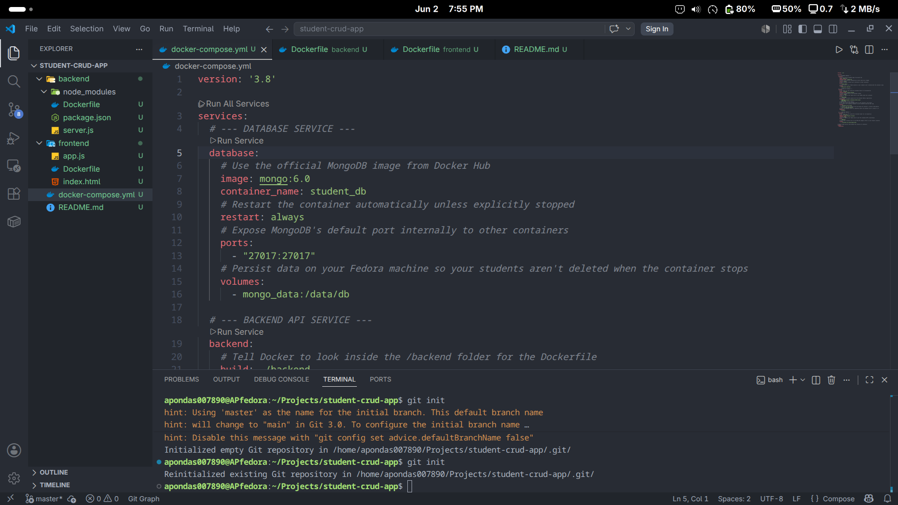

# 🎓 Global Institute - Dockerized Student Information System

A premium, localized, full-stack Student CRUD application engineered completely within isolated Docker environments. This architecture allows for a seamless development workflow without installing runtime dependencies like Node.js, NPM, or MongoDB on the local host operating system.

---

## 🚀 Key Features

* **Full CRUD Operations:** Seamlessly Add, Edit, Delete, and Search student profiles.
* **Instant Dynamic Registry Query:** Multi-parameter search filter (find records instantly by Institutional ID or Name).
* **Zero Host Contamination:** The database, API server, and web client spin up natively inside lightweight Linux containers.
* **Premium User Interface:** Styled with Tailwind CSS for an international institution aesthetic.
* **Hot-Reload Dev Workspace:** Local directory syncing automatically shifts code modifications directly into active running container spaces.

---

## 📸 System Preview



---

## 🛠️ Project Ecosystem

* **Frontend Engine:** HTML5 / Tailwind CSS (via CDN) / Vanilla ES6 JavaScript
* **Web Server Gateway:** Nginx (Alpine Linux Distribution)
* **Backend Framework:** Node.js / Express API Runtime
* **Database Management:** MongoDB 6.0 Non-Relational Database
* **Orchestration Layer:** Docker & Docker Compose

---

## 📂 Repository Architecture

```text
student-crud-app/
├── backend/
│   ├── Dockerfile          # Node.js alpine execution script environment
│   ├── server.js           # REST API routing logic & Mongoose schema design
│   └── package.json        # Node manifest mapping package dependencies
├── frontend/
│   ├── Dockerfile          # Nginx public routing image build blueprint
│   ├── index.html          # Dynamic Portal Layout Panel UI
│   └── app.js              # Fetch client communicating with API container
└── docker-compose.yml      # Network orchestration layer config file

## 🏁 Quick Start Commands

### Prerequisites

Ensure you have **Docker Engine** and **Docker Compose** set up on your host machine (fully tested on Fedora Linux configurations).

```bash
# Verify Docker is installed
docker --version
docker compose version
```

### 1. Clone the Repository

```bash
git clone https://github.com/your-username/student-crud-app.git
cd student-crud-app
```

### 2. Launching the Cluster

Navigate into your root workspace directory and fire up the containers:

```bash
docker compose up --build
```

**What this command does:**
- Builds the backend (Node.js) and frontend (Nginx) images
- Pulls the MongoDB image from Docker Hub
- Starts all three containers (database, backend, frontend)
- Streams logs from all services to your terminal

**Once initialized, open your browser and navigate to:**
- Frontend UI: `http://localhost:8080`
- Backend API: `http://localhost:5000/api/students`

### 3. Running in Background (Detached Mode)

```bash
docker compose up --build -d
```

### 4. View Logs (if running in background)

```bash
docker compose logs -f
```

### 5. Tearing Down Services

To stop running instances securely without data corruption, execute this command inside your terminal:

```bash
docker compose down
```

> **Note:** Your internal student data is continuously persisted inside a named Docker volume `mongo_data` even when services are powered down.

### 6. Full Cleanup (Delete Database as Well)

```bash
docker compose down -v
```

---

## 🔧 Development Workflow

### Why Docker Compose?

This project uses **Docker Compose** to orchestrate three interconnected services:

| Service | Container Name | Port | Purpose |
|---------|---------------|------|---------|
| **Database** | `student_db` | 27017 | MongoDB persistence layer |
| **Backend** | `student_backend` | 5000 | Express.js REST API |
| **Frontend** | `student_frontend` | 8080 | Nginx static file server |

### Hot-Reload Explained

The backend service uses a **bind mount** volume (`./backend:/usr/src/app`) which means:

1. You edit `server.js` in VS Code on your Fedora host
2. Docker instantly sees the change inside the container
3. `nodemon` automatically restarts the Express server
4. Your API is updated immediately — **no manual rebuild needed!**

### Database Persistence

Student data is stored in a named Docker volume `mongo_data`. This volume persists even after running `docker compose down`, ensuring your records are never lost unless you explicitly delete the volume:

```bash
# WARNING: This permanently deletes all student records!
docker compose down -v
```

---

## 📡 API Endpoints Reference

| Method | Endpoint | Description |
|--------|----------|-------------|
| `GET` | `/api/students` | Retrieve all students |
| `GET` | `/api/students?search=term` | Search by Student ID or Name |
| `POST` | `/api/students` | Add a new student |
| `PUT` | `/api/students/:id` | Update an existing student |
| `DELETE` | `/api/students/:id` | Remove a student |

### Sample API Request (POST)

```json
{
  "studentId": "STU-2024-001",
  "name": "John Doe",
  "email": "john.doe@global.edu",
  "department": "Computer Science"
}
```

### Sample API Response (GET)

```json
[
  {
    "_id": "67f8a2b3c4d5e6f7g8h9i0j1",
    "studentId": "STU-2024-001",
    "name": "John Doe",
    "email": "john.doe@global.edu",
    "department": "Computer Science",
    "__v": 0
  }
]
```

---

## 🐳 Docker Commands Cheat Sheet

| Command | Purpose |
|---------|---------|
| `docker compose up --build` | Build images and start all containers (attached mode) |
| `docker compose up -d --build` | Build and start containers in background (detached) |
| `docker compose down` | Stop and remove containers (preserves database) |
| `docker compose down -v` | Stop, remove containers, AND delete database volume |
| `docker compose logs -f` | Follow live logs from all services |
| `docker compose ps` | Show running container status |
| `docker compose restart` | Restart all services |
| `docker compose stop` | Stop containers without removing them |
| `docker compose start` | Start stopped containers |
| `docker exec -it student_backend bash` | Open a shell inside the backend container |
| `docker exec -it student_db mongosh` | Open MongoDB shell directly |

---

## 🧪 Testing the Application

### Using Browser (Frontend)

1. Open `http://localhost:8080`
2. Use the **Search** field to filter students by ID or Name
3. Click **Add Student** to create a new record
4. Use **Edit** and **Delete** buttons to modify or remove records

### Using curl (Backend API)

```bash
# Get all students
curl http://localhost:5000/api/students

# Search for a student
curl "http://localhost:5000/api/students?search=STU-2024"

# Add a new student
curl -X POST http://localhost:5000/api/students \
  -H "Content-Type: application/json" \
  -d '{"studentId":"STU-999","name":"Jane Smith","email":"jane@global.edu","department":"Mathematics"}'

# Update a student (replace :id with actual MongoDB _id)
curl -X PUT http://localhost:5000/api/students/67f8a2b3c4d5e6f7g8h9i0j1 \
  -H "Content-Type: application/json" \
  -d '{"name":"Jane Updated","department":"Physics"}'

# Delete a student
curl -X DELETE http://localhost:5000/api/students/67f8a2b3c4d5e6f7g8h9i0j1
```

---

## 📋 Troubleshooting Guide

### Port Already in Use

```bash
# Check what's using port 5000 or 8080
sudo lsof -i :5000
sudo lsof -i :8080

# Kill the process or change ports in docker-compose.yml
```

### Permission Denied (Docker Socket)

```bash
# Add your user to docker group
sudo usermod -aG docker $USER

# Log out and log back in, or run:
newgrp docker

# Verify it worked
docker run hello-world
```

### MongoDB Connection Failure

If the backend logs show `MongoDB connection failed`, the database container may be starting slowly. The `server.js` includes a **retry logic** that will automatically reconnect every 5 seconds until successful.

### Permission Denied When Deleting .next Folder

Files created by Docker containers may be owned by `root`. Use `sudo` to delete:

```bash
sudo rm -rf .next
```

### Container Won't Start

```bash
# Check logs for specific errors
docker compose logs backend
docker compose logs database

# Rebuild without cache
docker compose build --no-cache
docker compose up
```

---

## 📦 Project Structure Details

### Backend (`/backend`)

| File | Purpose |
|------|---------|
| `Dockerfile` | Builds Node.js 18 Alpine image with `nodemon` for hot reload |
| `server.js` | Express server with Mongoose schema + full CRUD routes |
| `package.json` | Dependencies: `express`, `mongoose`, `cors`, `nodemon` |

### Frontend (`/frontend`)

| File | Purpose |
|------|---------|
| `Dockerfile` | Uses `nginx:alpine` to serve static files |
| `index.html` | Tailwind CSS styled UI with forms and table |
| `app.js` | Vanilla JavaScript fetch client for API communication |

### Root Directory

| File | Purpose |
|------|---------|
| `docker-compose.yml` | Orchestrates all three services with networking and volumes |

---

## 🛑 Stopping and Cleaning Up

```bash
# Graceful shutdown (preserves database)
docker compose down

# Full cleanup (deletes database volume)
docker compose down -v

# Remove all unused Docker resources
docker system prune -a

# Remove everything including volumes
docker system prune -a --volumes
```

---

## 🤝 Contributing

1. Fork the repository
2. Create a feature branch (`git checkout -b feature/amazing-feature`)
3. Commit your changes (`git commit -m 'Add amazing feature'`)
4. Push to the branch (`git push origin feature/amazing-feature`)
5. Open a Pull Request

---

## 📄 License

This project is licensed under the MIT License - see the LICENSE file for details.

---

## 🙏 Acknowledgments

- Docker Inc. for containerization technology
- MongoDB for the NoSQL database
- Express.js community for the lightweight web framework
- Tailwind CSS for the utility-first styling

---

## 📞 Support

For issues, questions, or contributions, please open an issue in the GitHub repository or contact the maintainer directly.

---

**Built with 🐳 Docker, Node.js, Express, and MongoDB**
```
